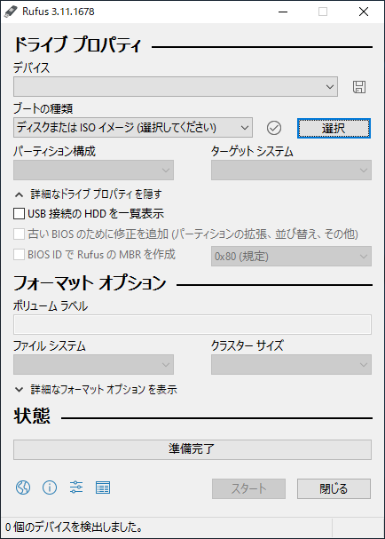

<!--

This document is written in Markdown.
You can preview on such as VisualStudio Code.
If you want to know more, search with "vscode markdown" or refer to official document https://code.visualstudio.com/Docs/languages/markdown .

-->

# 1. インストールメディアを作成

## 手順
ここではWindowsでのやり方を提示する。

UbuntuはLinuxの基本的なプログラムにその他便利なソフトをセットにしたもの(ディストリビューション)のひとつであり、OSである。

そしてここではそのOSを"インストールするためのOSのようなもの"を作成する方法を説明する。

1. ウェブサイトからisoイメージをダウンロードする。
	- isoイメージとはCDやDVDなどに入っているデータを仮想的にファイルにしたようなものである。
	- [ubuntu.com Download](https://ubuntu.com/download/desktop)

2. isoイメージをUSBメモリに焼く
	- 説明の通りisoはCDなどに入れるものなのだがUSBメモリに入れる。USBの方が読み込み速度が速いためである。
	- rufusというフリーソフトを使うことが多い。
	- 
	- "デバイス"からisoイメージを焼くUSBメモリを選択。
	- "選択"からisoファイルを指定する。
	- 後は基本的に触らずスタート

	USBメモリの中のデータはすべて消えるのでどこかに移しておく。

3. USBメモリをインストールするPCに挿す。

## Ubuntuのリリースについて
- Ubuntuは年に2回アップデートがある。(普通は4月と10月)
- Ubuntuは2年に一回長期サポート版 : LTS(Long-Term Support)を出す。

	| Version | Release Date |
	|---|---|
	|...|...|
	| Ubuntu 20.04 LTS | 2020年4月 |
	| Ubuntu 20.10 | 2020年10月 |
	| Ubuntu 21.04 | 2021年4月 |
	| Ubuntu 21.10 | 2021年10月 |
	| Ubuntu 22.04 LTS | 2022年4月21日(予定) |

- さらにマイナーバージョンのバージョンナンバーが"Ubuntu 20.04.x LTS"のようにつく。
- 今回は"20.04.3"を利用する。"20.04.4"が最新であるが諸事情により一個前のバージョンを利用する。
- ちなみにそれぞれデスクトップ画像の生き物が違う。20.04はネコっぽいもの。かわいい。(正確にはネコ科のフォッサ)
- そのあとは順にゴリラ、カバ、サル...やっぱりネコだな。22.04 LTSはクラゲ? やはりネコで行きましょう。

## Ubuntu DesktopとUbuntu Server

- UbuntuにはウィンドウやカーソルなどのGUIが備わった`Desktop`とCUIだけの`Server`が存在する。
- 今回はUbuntu Desktopを使う。
- 念のために書くが、普通に使う計算機だろうと何かサービスを実行するものはすべてサーバーであり、よく想像するサーバールームにぎっしり並んでランプが光っているものだけをサーバーと呼ぶわけではない。長時間かかる計算をさせて放置するならば十分にサーバー、計算サーバーである。
- 逆にデスクトップに`Xeon`や`Epyc`などのCPUを搭載しても構わない。是非搭載するべきである。

---

[次のセクション "2. ブート" へ](./2_Boot.md)

----
[Back to Home](../readme.md)

<!-- Written by Croyfet in 2022-->
