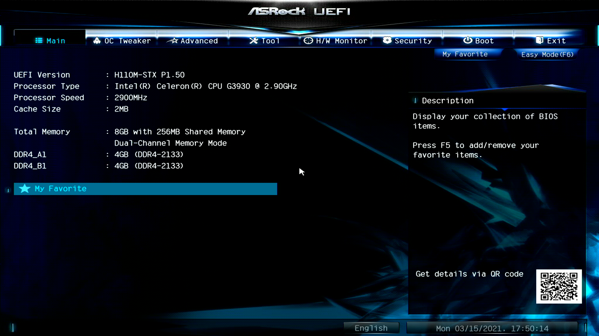
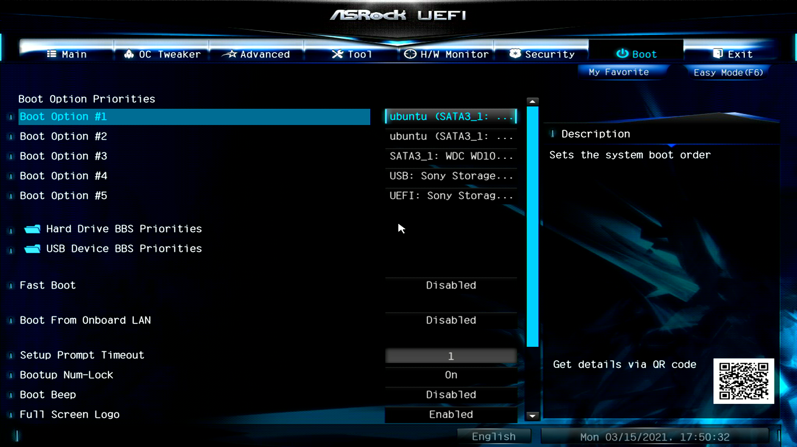

<!--

This document is written in Markdown.
You can preview on such as VisualStudio Code.
If you want to know more, search with "vscode markdown" or refer to official document https://code.visualstudio.com/Docs/languages/markdown .

-->

# 2. ブート

計算機は様々な場所からOSを読み込むことができる。内部に搭載されているSSDやHDD、USBポートに刺さっているメモリ、さらに高度なテクニックではネットワークからも読み込むことができる。

OSのインストールメディアは"OSをインストールするためのOS"のようなものである。

普段はOSが入っている内部のSSDなどからOSを読み込むことが普通のため、USBからインストールメディアを読み込むためには読み込みの順番を変更する必要がある。

## 1. UEFIの設定画面に入る

OSを読み込むためにはUEFI(Unified Extensible Firmware Interface)の設定画面に入る必要がある。

手順
1. Deleteキーを連打

UEFIのデザインはメーカーごとに違うが大まかな機能は同じである。(画像はASRock)

## 2. Bootの設定

基本的に`矢印`キー、`Esc`キー、`Enter`キーを使って操作する。
最近のPCではマウスが使えるものが多いが普通はキーボードを使う。

手順
1. `Boot`の項目に移動
	
2. Bootの順番を変え1番最初をUbuntuを入れたインストールメディアに設定。
3. `Exit`に移動して"Save Changes and Reset"で設定を適応し計算機を起動。

すでに入っているUbuntuなどを間違えて選択しないように気を付けたい。

---

[次のセクション "3. インストール" へ](./3_Installation.md)

----
[Back to Home](../readme.md)

<!-- Written by Croyfet in 2022-->
