<!--

This document is written in Markdown.
You can preview on such as VisualStudio Code.
If you want to know more, search with "vscode markdown" or refer to official document https://code.visualstudio.com/Docs/languages/markdown .

-->

# 3. インストール

## 1. OSの選択

1. 一番上の`Ubuntu`を選択
	- すぐにキーを押さない場合、デフォルトで`Ubuntu`が選択される。
	- 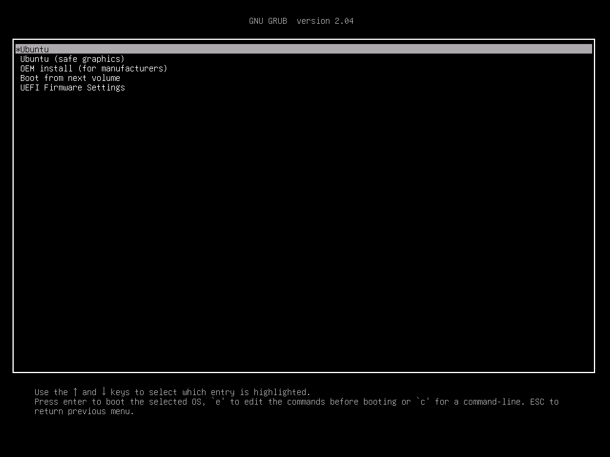

## 2. 設定

1. 英語でInstall Ubuntu
	- `Try Ubuntu`で直接USB上からUbuntuを利用できるが今回はインストールするため`Install Ubuntu`を選択。
	- 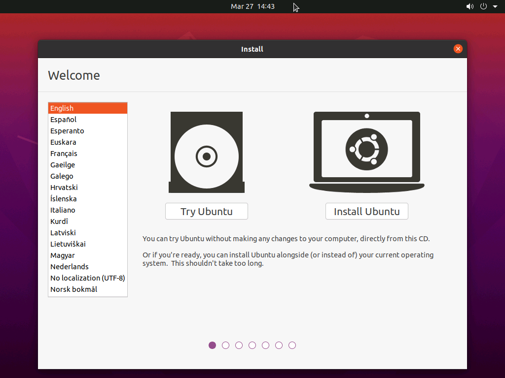

2. キーボード配列の選択
	- 使用しているキーボードに応じて選択する。普通はJapanese - Japaneseで問題ない。
	- 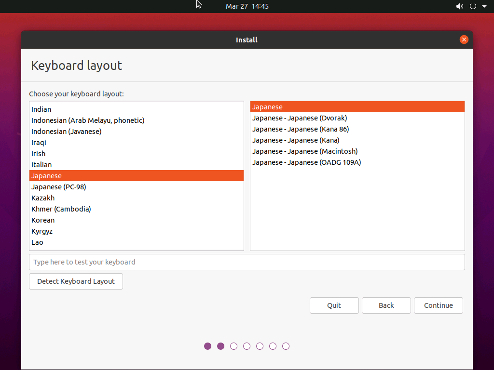

3. ソフトウェアに関する選択
	- `Minimal Installation`を選択する。(`Normal installation`では余計なソフトが入ってくる)
	- 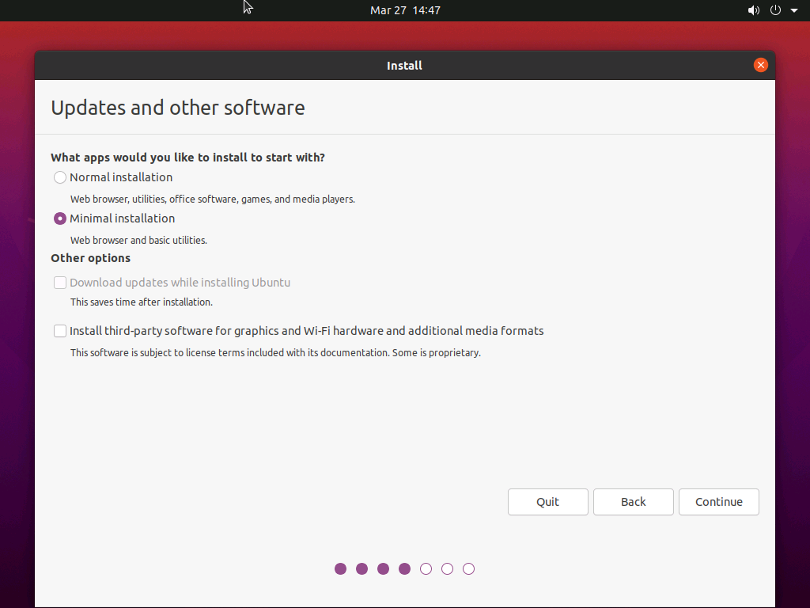

4. インストール先の指定
	- 触らなくて構わない。
	- 複数存在しているならSSDを選択。
	- 選択後確認が出る。
	- 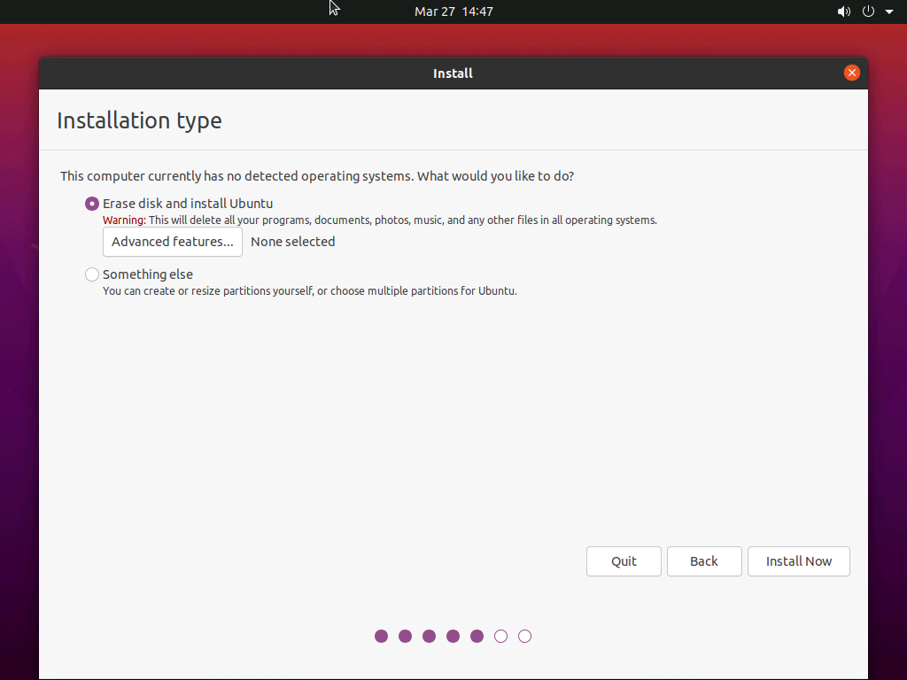

5. リージョン設定
	- Tokyoを選択
	- マウスで選択でも構わないし入力も可能
	- 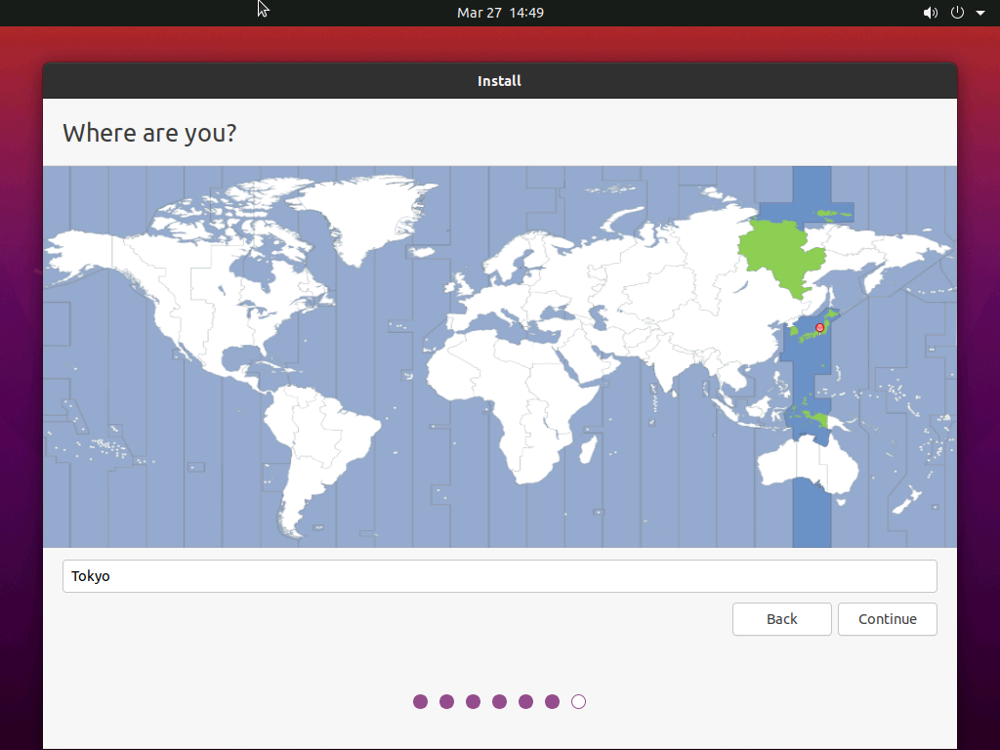

6. 名前
	- `Your name`に自由に名前を選択。
	- `Your computer's name`は自由に選択。ネットワーク上に表示されることもあるためその識別用。
	- `Pick a username`はそのまま。
	- あとはそのまま。
	- 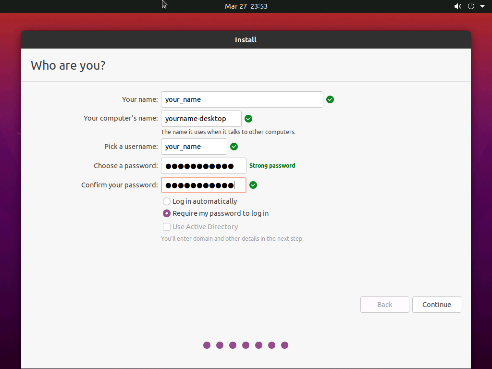

7. 再起動

8. 初期設定
	- Doneで飛ばして構わない。
	- 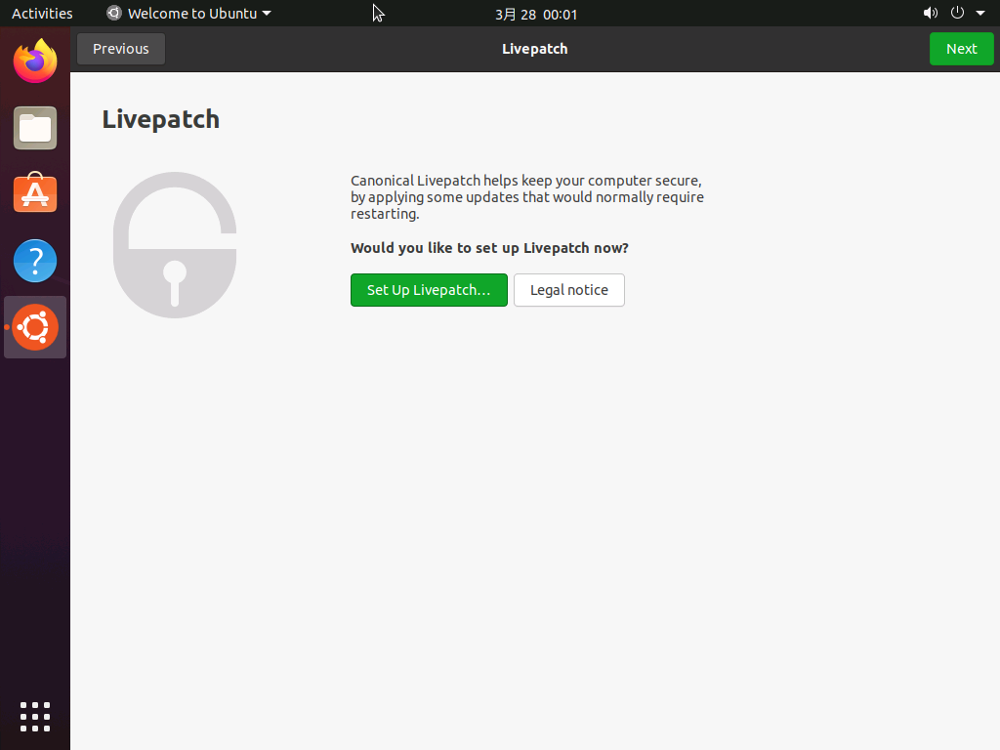
	- 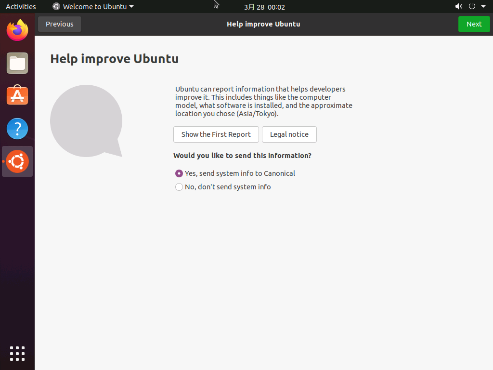
	- 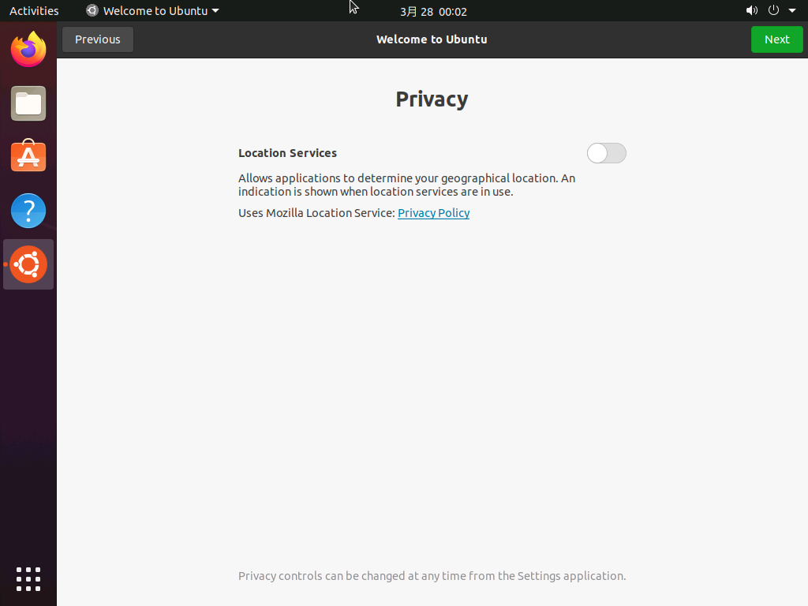
	- 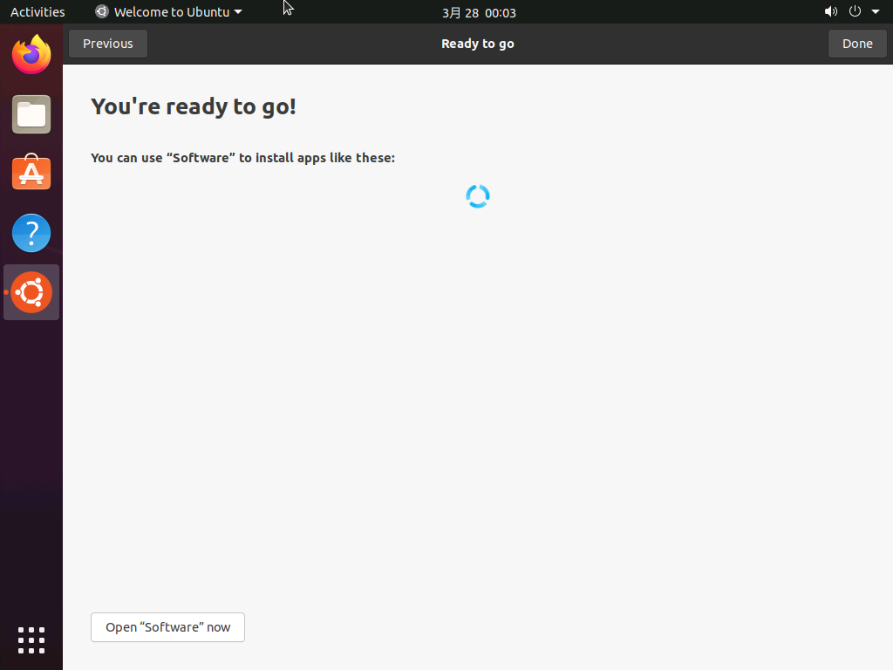

----

[次のセクション "4. ネットワーク設定" へ](./4_Network.md)

----
[Back to Home](../readme.md)

<!-- Written by Croyfet in 2022-->
