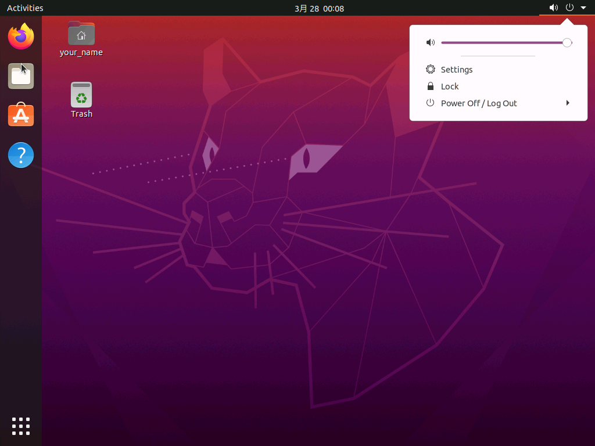
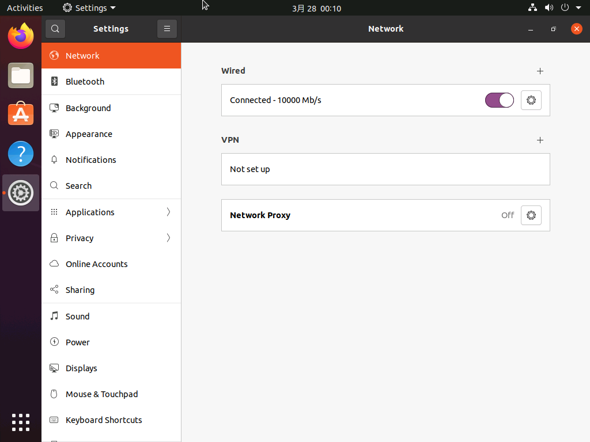
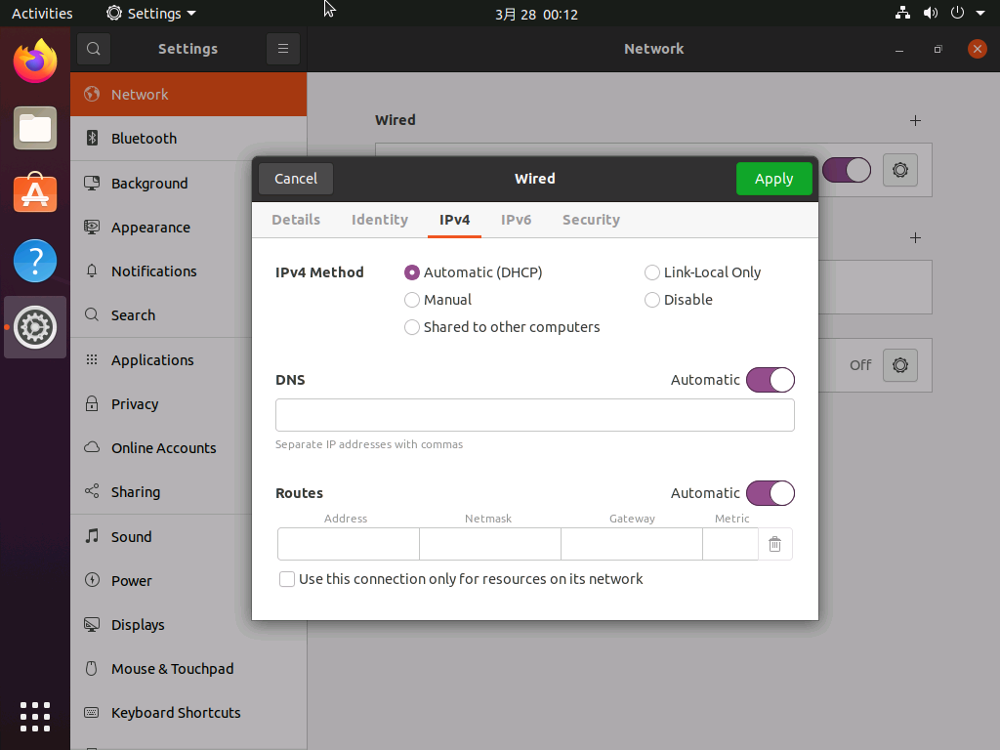
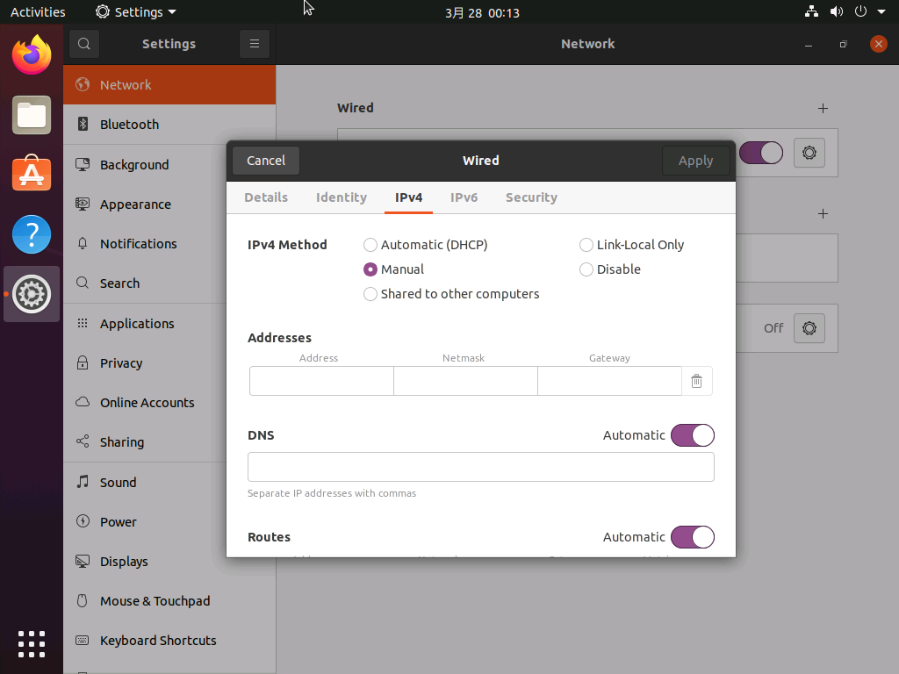

<!--

This document is written in Markdown.
You can preview on such as VisualStudio Code.
If you want to know more, search with "vscode markdown" or refer to official document https://code.visualstudio.com/Docs/languages/markdown .

-->

# 4. ネットワーク設定

## ネットワーク設定画面を開く

1. デスクトップの右上から`Settings`を選択
	- 
	- 

2. Wiredから歯車を選択して設定画面を開く
	- IPv4のタブを開く
	- 

3. MethodをManualへ変更
	- 

## ネットワークについて

### DHCP
普段、インターネットに接続する場合には`IPアドレス`を気にすることは少ないかもしれない。しかし`IPアドレス`がないと接続することができないので適切な`IPアドレス`を自動的に割り振ってもらう方法があり、それがDHCPである。

`DHCPサーバー`によりIPアドレスを割り振ってもらうがこれは一般的に売っている`ルーター`がDHCPサーバーを持っており、その役割を担っている。

### DNS(Domain Name System)
ブラウジングをしているときに"https://google.com/"などのURLを打ち込んで接続することがあるだろうがアクセスするためにはIPアドレスが必要である。そしてURLとIPアドレスを変換するのがDNSという仕組みである。

DNSは計算機が持っている`hostsファイル`、そこで見つからなければ`DNSサーバー`に問い合わせる。
そしてその問い合わせた`DNSサーバー`が情報を持っていなければさらに上位の`DNSサーバー`に問い合わせる。

一般的にローカルネットワークではルーターが`DNSサーバー`を持っている。

### Gateway
ローカルネットワークはグローバルネットワークに出るための入口が普通あるはずである。一般のネットワークでは`ルーター`である。

## ネットワークの接続に必要なもの

今回、`IPアドレス`は自分で設定するため`DHCP`は使わない。
つまりインターネットに接続するために以下の情報が最低限必要であり、設定する。

- IPアドレス
- DNS
- Gateway

----

[次のセクション "5. 基本コマンドとディレクトリ" へ](./5_BasicCommandAndDirectory.md)

----
[Back to Home](../readme.md)

<!-- Written by Croyfet in 2022-->
