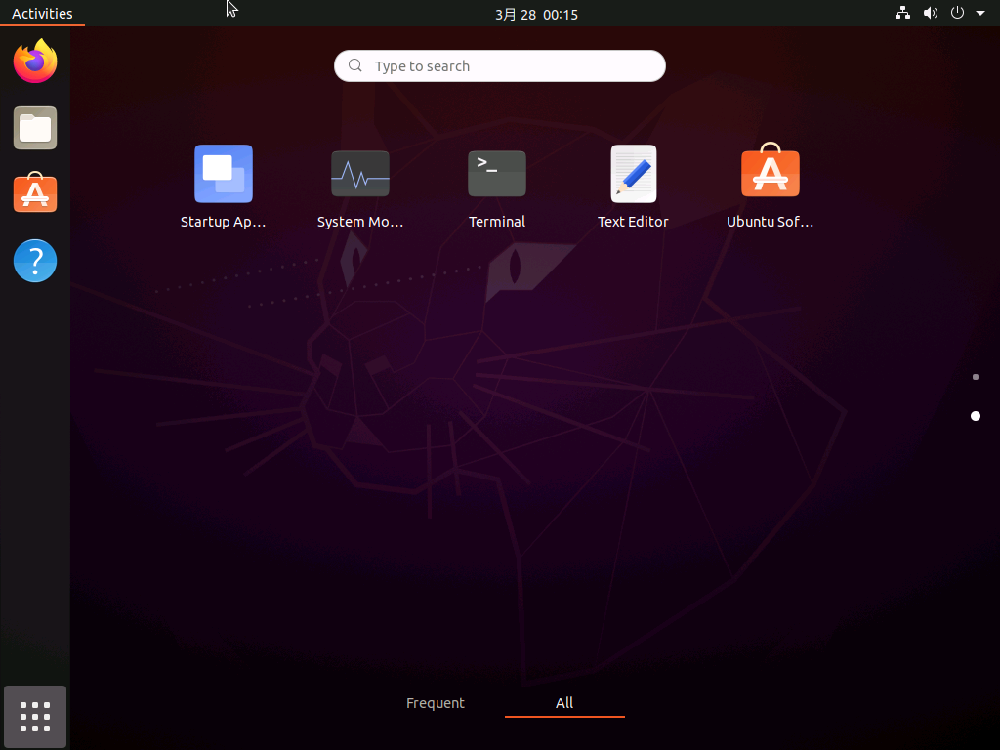

<!--

This document is written in Markdown.
You can preview on such as VisualStudio Code.
If you want to know more, search with "vscode markdown" or refer to official document https://code.visualstudio.com/Docs/languages/markdown .

-->

# 5. 基本コマンドとディレクトリ

Linuxでは基本的な操作はウィンドウやマウスなどを使った`GUI`ではなく`CUI`で行われる。
Ubuntuなどで使われているGUIはおまけのようなものであり、GUIを使うことは甘えである。

## ターミナル/端末/シェル

ターミナルを開く。やり方は2通り

1. アイコンから
	- デスクトップの左下のアイコンをクリックし、スタートメニューを開く
	- Terminalを探し開く。
	- 

2. Ctrl + Alt + T

## ターミナルの見方

```
_YOUR_NAME_@_MACHINE_:~$
```

- \_YOUR\_NAME\_
	- 現在操作しているユーザー

- \_MACHINE\_
	- ホスト名(操作している計算機の名前)

- ":"と"$"の間
	- ワーキングディレクトリ(操作しているディレクトリ)
	- ここについては次項

## ディレクトリ

LinuxではWindowsやMacにおける`フォルダ`のことを階層的な概念を強めて`ディレクトリ`が重要である。

Ubuntuでは記憶デバイスの一番上の階層を`/`(`ルートディレクトリ`)と表し以下のようになっている

```
/bin
/boot
/cdrom
/dev
....(省略)
```

この中で絶対に覚えていなければいけないディレクトリが以下である。

- etc
	- ソフトの設定ファイルを置く場所。
	- すべての設定は大抵ここにある。

- home
	- ユーザーごとのディレクトリが入っている。
	- USER_01とUSER_02がいる場合、USER_01、USER_02のディレクトリがある。

	- そしてその`ユーザーディレクトリ`が`ワーキングディレクトリ/カレントディレクトリ`での"`~`"となる。
	- たとえばUSER_01でログインしている場合"`~`"は"/home/USER_01"を指し、USER_02でログインしている場合の`~`は"/home/USER_02"を指す。

- opt
	- 自分でコンパイルしたりして入れたソフトはここに置く

- mnt
	- HDDを追加する場合ここか、この下にディレクトリを作成してそこにマウントする。
	- (Linuxでは空のディレクトリに他のHDDなどの記憶デバイスをマウント(接続)させて使う。)

他も必要に応じて調べておくとよ良い。


## [command] `ls` (List Segments)
```
ls [options] [file]
```

指定したファイルを列挙する。

### カレントディレクトリ
ファイルを指定しない場合現在いる階層のファイルを列挙する。
起動してすぐなら`~`:`ユーザーディレクトリ`にいるはずなので以下のように表示されるはずである。
```
_YOUR_NAME_@_MACHINE_:~$ ls
Desktop Documents Downloads Music Pictures Public Templates Videos
```
### オプションをつける(-l)
リスト表示される。
以下の場合はカレントディレクトリをリスト表示する。
詳しい説明は後述する。
```
_YOUR_NAME_@_MACHINE_:~$ ls -l
```

### オプションをつける(-a)
Linuxではピリオドから始まるファイルやディレクトリは表示されない。それを表示する。
```
_YOUR_NAME_@_MACHINE_:~$ ls -a
```

### オプションを組み合わせる
`-l` + `-a`
```
_YOUR_NAME_@_MACHINE_:~$ ls -la
```

### 別のディレクトリ
カレントディレクトリを表示したとき、Desktopなどのディレクトリがあることが分かった。
```
_YOUR_NAME_@_MACHINE_:~$ ls
Desktop Documents Downloads Music Pictures Public Templates Videos
```
以下の用に指定することでDesktopの中身をみる。ちなみにオプションもつけてみた。
```
_YOUR_NAME_@_MACHINE_:~$ ls Desktop -l
_YOUR_NAME_@_MACHINE_:~$
```
おそらくまだ何も存在しないので何も表示されない


## [command] `cd` (Change Directory)
ディレクトリを移動する。
```
cd [options] [dir]
```
私は一切optionsは利用したことがないのでほぼ用事はない。

### Desktopに移動
```
_YOUR_NAME_@_MACHINE_:~$ cd Desktop
_YOUR_NAME_@_MACHINE_:~/Desktop$
```

### 上の階層に移動
`~/Desktop`から`~`に移動
```
_YOUR_NAME_@_MACHINE_:~/Desktop$ cd ../
_YOUR_NAME_@_MACHINE_:~$
```

### 上の階層に移動して一気にDocumentsに移動
`~/Desktop`から`~/Documents`に移動
```
_YOUR_NAME_@_MACHINE_:~/Desktop$ cd ../Documents
_YOUR_NAME_@_MACHINE_:~/Documents$
```

### 絶対パスで指定
今までは"下に移動"、"上に移動"を現在いるディレクトリから相対的に指定していた。

しかし"`~`"は一番上の階層からだと"/home/\_YOUR\_NAME\_"である。この一番上の階層からのパス : `絶対パス`という。

`絶対パス`で"\_YOUR\_NAME\_"ユーザーのDesktopのディレクトリに移動したかったら

```
cd /home/\_YOUR\_NAME\_/Desktop
```
と書ける。

### ルートディレクトリ(一番上の階層)に移動
```
cd /
```
ここで`ls`をすれば前述の覚えておきたいディレクトリ名が見つかるはずである。

ちなみに`絶対パス`は`ls`などのコマンドでも使うことができる。

## [command] `touch`
タイムスタンプ(ファイルの変更時間)を更新するコマンド。
```
touch [options][file]
```
だがそのファイルが存在しない場合、空のファイルを作成する。この使い方のほうが多いかもしれない。

## [command] `mkdir` (Make Directory)
```
mkdir [options][file]
```
ディレクトリを作成

## [command] `rm` (ReMove)
ファイルを削除
```
rm [file]
```

## [command] `rmdir` (ReMove DIRectory)
ディレクトリを削除
```
rmdir [dir]
```


## ファイル操作
上記のコマンドを使えば基本的なことはできる

1. Desktopに移動
	```
	_YOUR_NAME_@_MACHINE_:~$ cd Desktop
	_YOUR_NAME_@_MACHINE_:~/Desktop$
	```

2. ファイルを作成
	- testというファイルを作成
	- DesktopにいるのでDesktopにtestが表示される。
	```
	_YOUR_NAME_@_MACHINE_:~/Desktop$ touch test
	```

3. 作成したファイルを確認
	- `ls`コマンドで確認できる
	```
	_YOUR_NAME_@_MACHINE_:~/Desktop$ ls
	test
	_YOUR_NAME_@_MACHINE_:~/Desktop$
	```

4. 上の階層に移動
	```
	_YOUR_NAME_@_MACHINE_:~/Desktop$ cd ../
	_YOUR_NAME_@_MACHINE_:~$
	```

5. Desktopに入っているtestファイルを削除
	```
	_YOUR_NAME_@_MACHINE_:~$ rm 
	```

## [command] vim
テキストエディターのひとつ
```
vim [file]
```
code(vscode)でもemacsでもかまわないがただのエディターである。

`ノーマルモード`と`入力モード`がある。

### Insert
vimはそのままではノーマルモードで文字を書き込むことはできない。
キーを押すと下に文字が表示されるはずである。

`Esc`を押してから`i`を押すと`ノーマルモード`から`入力モード`の`Insertモード`になり書き込むことができる。

### Save
`Esc`を押し`入力モード`から`ノーマルモード`に切り替え`:wq`(Write and Quit)で保存してコンソールに戻れる。

他にもコマンドがあるので調べるといい。


### [command] sudo (Substitute User DO)
コマンドをrootユーザーとして実行する
```
sudo [command]
```
sudoコマンドの後ろに今まで使ってきたコマンドを使用する。

### ex.)touch
touchコマンドをsudo つけるつけないで実行する
```
_YOUR_NAME_@_MACHINE_:~$ touch test_user
_YOUR_NAME_@_MACHINE_:~$ sudo touch test_root
```
lsで取得すると
```
_YOUR_NAME_@_MACHINE_:~$ ls -l
```
所有者が変わってるはずである。削除するならそのファイルの所有者かrootで削除しなければならない
```
_YOUR_NAME_@_MACHINE_:~$ rm test_user
_YOUR_NAME_@_MACHINE_:~$ rm test_root //エラー

_YOUR_NAME_@_MACHINE_:~$ sudo rm test_root
```


----

[次のセクション "6. コンソールでの設定" へ](./6_SettingsOnConsole.md)

----
[Back to Home](../readme.md)

<!-- Written by Croyfet in 2022-->
