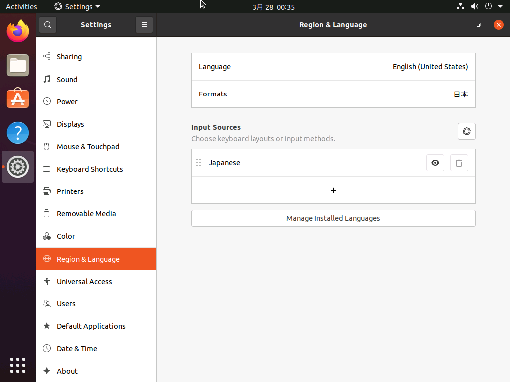
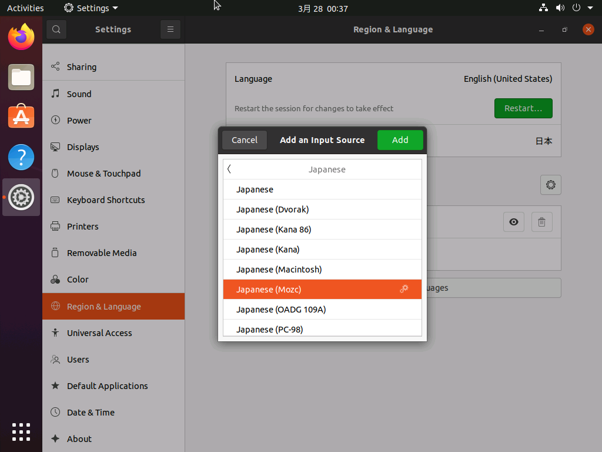
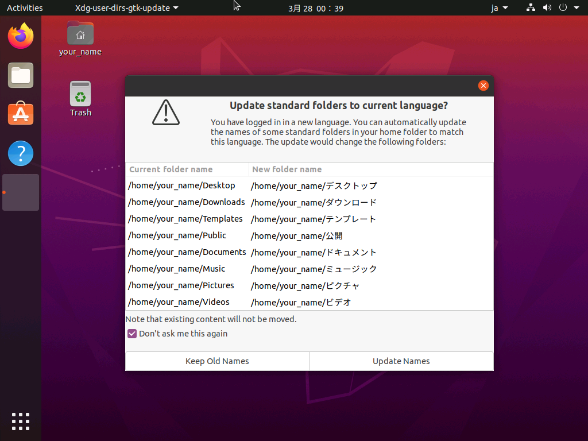

<!--

This document is written in Markdown.
You can preview on such as VisualStudio Code.
If you want to know more, search with "vscode markdown" or refer to official document https://code.visualstudio.com/Docs/languages/markdown .

-->

# 6. コンソールでの設定

## rootのパスワード

1. suコマンドでログインユーザーを変更する。
	- ユーザーを指定しないとrootとしてのログインになる。
	```
	_YOUR_NAME_@_MACHINE_:~$ sudo su
	root@_MACHINE_:/home/_YOUR_NAME_$
	```

2. `passwd`コマンドでパスワードを設定する。

	```
	root@_MACHINE_:/home/_YOUR_NAME_$ passwd
	```

	rootユーザーはsudoをつけなくていいしファイルの所有者でなくても好きに消したりすることができる。これがrootのパスワードが奪われてはいけない理由である。

	ちなみにLinuxベースであるAndroidの`root化`もこのrootユーザーに脆弱性などからログインしてすべての権限を取得する行為である。

3. `exit`コマンドで戻る

## `apt`

Ubuntuにソフトを入れる方法はいくつかある。
- `apt`などのパッケージを使う
- `sh`や`dpkg`のインストーラーで入れる
- 自分でコンパイル

そして一番メジャーな方法が`apt`というパッケージを使う方法である。
あらかじめ有名なソフトはパッケージに登録されていてコマンド一つでインストールできる。
他のOSでいうなれば`AppStore`や`GooglePlay`、`MicrosoftStore`である。

1. aptのアップデート
	- ソフトの更新がないかを確認
	```
	sudo apt udpate
	```
2. aptのアップグレード
	- 更新があったソフトの更新。指定しなければ一括更新
	```
	sudo apt upgrade
	```

Ubuntuでは`apt`の他に`apt-get`というaptの前身となった古いものや新しい`aptitude`がある。
`apt-get`は今更使わなくていいし`aptitude`はバグがあるのかあまり好かれていない。
もし何かをインストールするとき古いサイトだと`apt-get`が使われているが脳死でコピペするのではなく`apt`に書き直す。
大抵のオプションは同じなので問題ないはずである。

ここまで来たら再起動

## 日本語環境のインストール
先ほどに引き続き`apt`コマンドを使っていく。

今回はinstallオプションを使う。

日本語はバグの元なので使わないほうがいいが少なくとも日本語キーボードは追加しておいたほうがいい。

1. 日本語キーボードの追加
	```
	sudo apt install ibus-mozc
	```

2. システムの日本語説明
	```
	sudo apt install language-pack-ja
	```

## 日本語環境の設定

Settings > Region & Language



## Language

上のLanguageから日本を選択

## Keyboard

"+"を押してJapanese > Japanese(Mozc)



以上の設定をしたら再起動

ちなみにコマンドでするなら
```
sudo reboot -h now
```
"-h now"オプションをつけないと30秒後に再起動などになる。

## 再起動後

再起動後に、言語を変更したのでユーザーディレクトリの"Desktop"や"Documents"を"デスクトップ"や"ドキュメント"などの日本語表記に変更するか提案してくる。



もしディレクトリを移動したいときにわざわざ
```
_YOUR_NAME_@_MACHINE_:~$ cd デスクトップ
```
と"cd"と打った後に"半角/全角キー"を押すこととなったり、文字化け、最悪ソフトが日本語ディレクトリに対応していないことがある。

絶対に日本語に変更してはいけない。

"Dont't ask me this again"にチェックを入れて二度と拝めなくして挙げてよろし。

(読めるとは思うが)"Keep old Names"(古い名前を維持)を押すこと。

----

[次のセクション "7. その他のソフトのインストール" へ](./7_OtherSoftware.md)

----
[Back to Home](../readme.md)

<!-- Written by Croyfet in 2022-->
