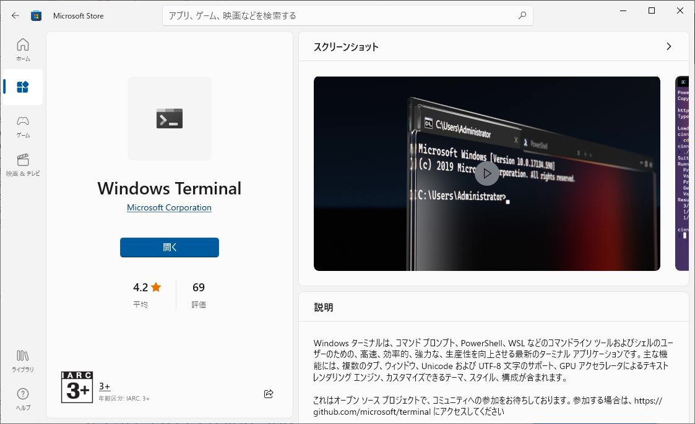

<!--

This document is written in Markdown.
You can preview on such as VisualStudio Code.
If you want to know more, search with "vscode markdown" or refer to official document https://code.visualstudio.com/Docs/languages/markdown .

-->

# 8. Secure Shell

LinuxなどのShellにネットワークからリモートアクセスする。

## ホスト側(Linux側)の設定

1. sshのインストール

	```
	sudo apt install ssh
	```

2. sshの起動
	- バックグラウンドで動くプログラムを`service`や`deamon`と呼ぶ。
	- sshのサービスが動かす。
	```
	sudo service ssh start
	```

3. serviceの確認
	- うまく動いているか確認する
	```
	sudo service ssh status
	```

正しく使うならばポートを変更したり、rootのログインを拒否することは当然であるがローカルであればまあいいだろう。
グローバルでアクセスする場合のrootのパスワードログインなどもっての外である。

ちなみにホスト側の設定は場合は`/etc/ssh/sshd_config`である。`/etc/ssh/ssh_config`はクライアントサイドの設定であるため気を付ける。

## クライアント側(Windows/Mac/Linux)の設定

Windowsの場合`Windows Terminal`や`PowerShell`、
MacとLinuxの場合は`Terminal`を開く。


```
ssh _USER_NAME_@_IP_ADDRESS_
```
でアクセスする。
様々なオプションをつけることができるため積極的に利用するようになったら知っておきたい。

ちなみに"\_USER\_NAME\_@"を付けない場合現在のクライアントサイドのユーザー名が使われる。

Windowsでの`Shell`は`コマンドプロンプト`が使われてきたが近年はその後継の`PowerShell`がとても強力である。さらにそのPowerShellをタブ管理できるソフト`Windows Terminal`が公式の`MicrosoftStore`から入手できる。
Windows11ではあるバージョンから標準になっているはず。
こちらを利用していきたい。



## アクセス

なお"192.168..."から始まるIPアドレスはプライベートIPアドレスと呼ばれる。全世界の家庭や組織にIPアドレスを割り振ると足りないのでIPアドレスはそれぞれの拠点でルーターによりプライベートIPアドレスに変換される。(`NAPT`)

つまり各拠点にそれぞれ別の"192.168..."などが割り振られる。したがって、同一ネットワークに居ない限り"192.168..."のプライベートIPアドレスを用いてアクセスすることはできない(ことはないが困難)。
簡単に言えば家からsshを飛ばして研究室の計算機にアクセスすることは困難。
また学校にはFirewallがあるため面倒が多い。

----

[次のセクション "9. おわりに" へ](./9_Final.md)

----
[Back to Home](../readme.md)

<!-- Written by Croyfet in 2022-->
